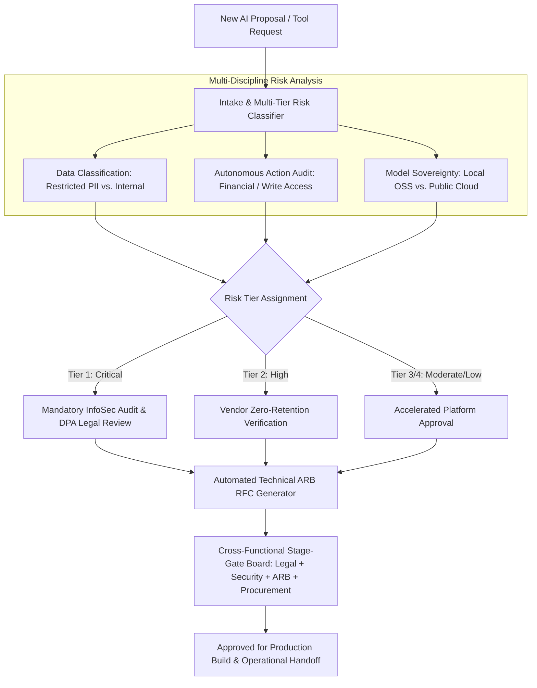

# 🏛️ AI-Program-OS: Enterprise AI Intake & Architecture Review Board (ARB) Governance

!(https://img.shields.io/badge/Python-3.9+-3776AB?style=for-the-badge&logo=python&logoColor=white)
!(https://img.shields.io/badge/UI-Streamlit-FF4B4B?style=for-the-badge&logo=streamlit&logoColor=white)
!(https://img.shields.io/badge/License-MIT-green?style=for-the-badge)
!(https://img.shields.io/badge/Domain-Enterprise_AI_Governance-6f42c1?style=for-the-badge)

> An open-source program operating system that replaces "Shadow AI" and review gridlock with standardized intake, multi-tier risk classification, automated Architecture Review Board (ARB) RFC generation, and cross-functional stage-gate transparency.

---

## 📌 The Problem: "Shadow AI" & Enterprise Governance Chaos

As enterprises rush to adopt artificial intelligence, business units (Payments, Customer Operations, Platform Engineering, Media Streaming) frequently deploy ad-hoc copilots and autonomous tools. Without a centralized program operating system, organizations face four critical vulnerabilities:

1. **Compliance & Data Privacy Exposure:** Sensitive customer records (PII, banking transactions, proprietary source code) are routed to public cloud LLMs without Data Processing Agreements (DPAs) or zero-retention guarantees.
2. **Fragile Architectures (No Graceful Degradation):** Prototypes look impressive in demos, but crash in production when third-party model APIs experience rate limits, latency spikes (>3.5s), or HTTP 5xx gateway outages because deterministic fallbacks were never engineered.
3. **Stage-Gate Gridlock:** InfoSec, Legal/Privacy, Enterprise Architecture, and Procurement lack a standardized intake format, leaving technical requests stalled in email threads for months.
4. **Duplicate Capital & Token Burn:** Multiple squads independently purchase redundant vendor subscriptions or build disconnected retrieval pipelines.

---

## 💡 The Solution: A Centralized AI Program Operating System

**AI-Program-OS** operationalizes the intake-to-deployment lifecycle through automated risk tiering, standardized technical documentation, and cross-functional sign-off visibility:




---

## 🛡️ Enterprise Risk Tiering Matrix

| Risk Tier | Data Sensitivity | Autonomous Actions | Required Governance & Approvals |
| :--- | :--- | :--- | :--- |
| **Tier 1 (Critical)** | Restricted PII / Financial Data | Enabled (Write / Financial) | Mandatory InfoSec Pen-Test, Signed Vendor DPA, ARB Approval |
| **Tier 2 (High)** | Confidential Corporate Data | Read-Only / Advisory | Legal Zero-Retention Verification, InfoSec Cloud Audit |
| **Tier 3 (Moderate)** | Internal Code / Knowledge Base | Local Agent Execution | Self-Hosted Open-Source Models (Ollama/vLLM), Fast-Track Review |
| **Tier 4 (Low)** | Public Documentation | None | Automated Intake Registration |

---

## ⚙️ Core Architectural Capabilities

### 1. Multi-Tier Risk Classification Engine
Evaluates submissions across data sensitivity, autonomous permissions, and model hosting boundaries to assign objective governance gates.

### 2. Automated Architecture Review Board (ARB) RFC Generation
Automatically translates business requests into engineering **RFC (Request for Comments)** specifications detailing:
* Business problem and measurable outcome targets.
* Data flow boundaries and network egress isolation.
* Mandatory **Graceful Degradation Plans** (deterministic rule-based fallbacks during LLM outages).
* Multi-discipline sign-off matrices.

### 3. Stage-Gate Governance Pipeline
A unified dashboard tracking four milestone review gates:
1. **Intake & Scope Definition**
2. **Security & Data Privacy Audit**
3. **Architecture Review Board (ARB) Technical RFC Review**
4. **Operational Readiness & Production Release Gating**

---

## 🛠️ Tech Stack

* **Engine:** Python 3.9+, Pydantic v2, Pandas
* **Portal & Dashboard:** Streamlit
* **Local Inference (Optional):** Ollama (`llama3.2:3b`)
* **License:** MIT License

---

## 🚀 Quickstart

### 1. Clone & Set Up
```bash
git clone [https://github.com/soniran635/ai-program-os.git](https://github.com/soniran635/ai-program-os.git)
cd ai-program-os

python3 -m venv venv
source venv/bin/activate

pip install -r requirements.txt

2. Launch the Portal
streamlit run ui/governance_portal.py

Open http://localhost:8501 to test the intake form, evaluate risk tiers, and generate Architecture Review Board RFCs in real time.

📂 Repository Structure
ai-program-os/
├── src/
│   ├── governance_engine.py  # Risk tiering, legal/security checks, RFC generation
│   └── models.py             # Pydantic schemas (Intake, RiskReport, ArchitectureRFC)
├── ui/
│   └── governance_portal.py  # Interactive Streamlit portal & stage-gate board
├── requirements.txt
└── README.md

📄 License
MIT License. Open source and free for the community.
